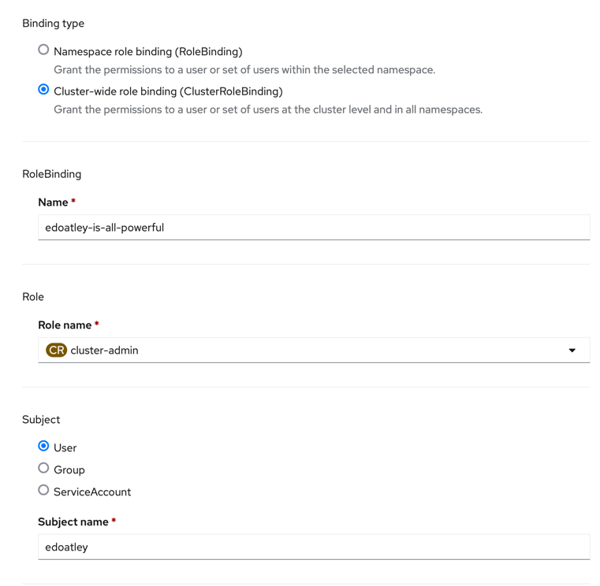
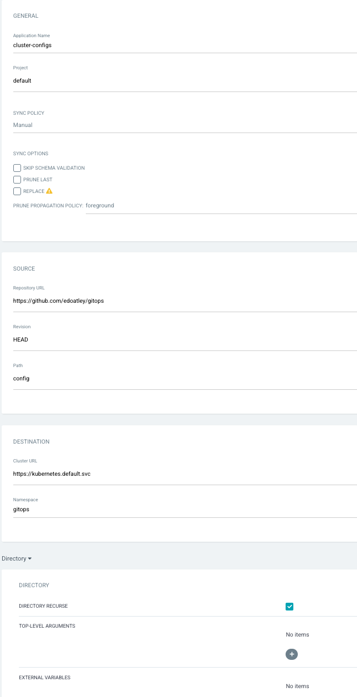
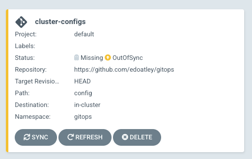
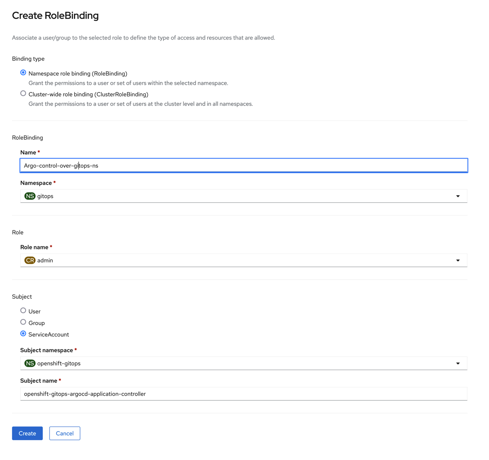
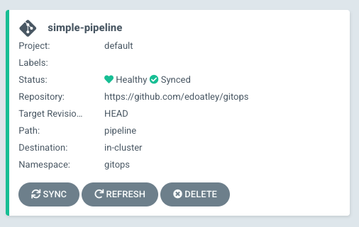
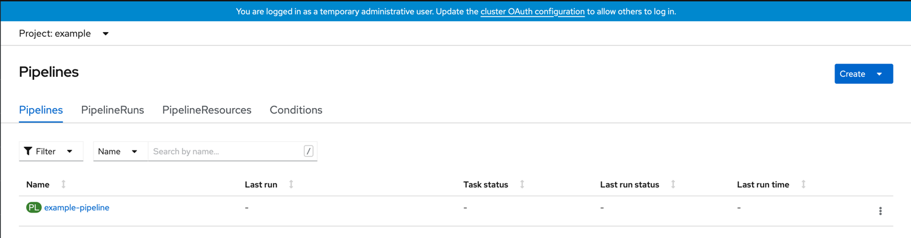
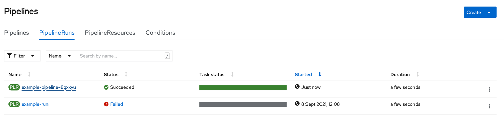
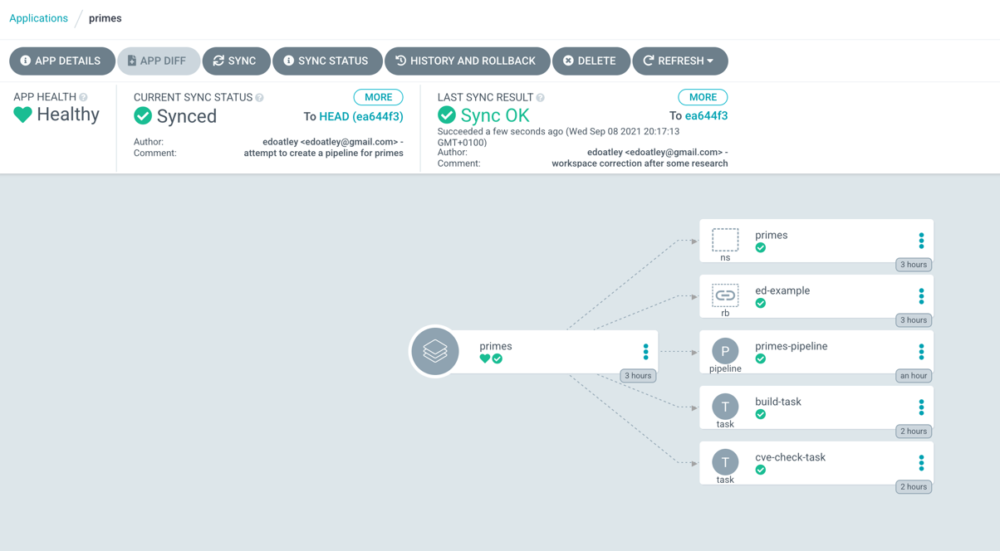
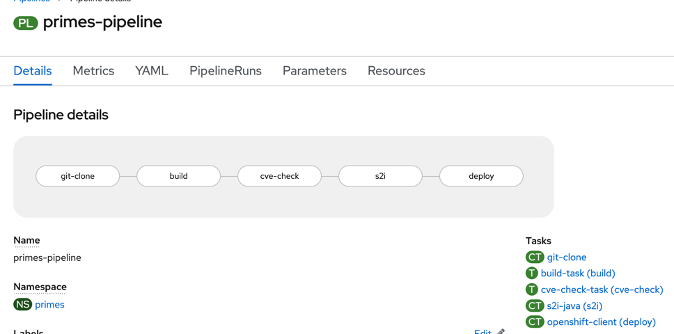

# gitops
Place to play with RH Gitops in openshift

## References

- This repository is inspired by [Dev Epihany Blog](https://devepiphany.org/2021/04/27/geitting-to-grips-with-gitops/)
- This is useful info [Getting Started with OpenShift GitOps](https://github.com/siamaksade/openshift-gitops-getting-started)
- [Official Pipelines Information](https://cloud.redhat.com/learn/topics/ci-cd)

## Prerequisites

### Create an Openshift Instance

* Create a project on GCP
* Download IPI and pull secret from RedHat
* Follow documentation and this [great article](https://cloud.redhat.com/blog/ocp-4.6-install-on-gcp-cloud-the-smooth-experience)
* Lots of trial and error when GCP misbehaved with errors I did not unterstand as never used it before!

## Create Identity provider

1. Went with a simple htpasswd 

```shell
htpasswd -c .htpasswd user
New password: 
Re-type new password: 
Updating password for user user
~/code/openshift/htpasswd ❯ htpasswd .htpasswd user2                                                                                                                                                        4s Py base 09:29:36
New password: 
Re-type new password: 
Adding password for user user2
```

created a secret for the htpasswd file:

```shell
oc create secret generic htpass-secret --from-file=htpasswd=.htpasswd -n openshift-config
```

then applied:

```yaml
apiVersion: config.openshift.io/v1
kind: OAuth
metadata:
  name: cluster
spec:
  identityProviders:
    - name: htpasswd-provider
      mappingMethod: claim
      type: HTPasswd
      htpasswd:
        fileData:
          name: htpass-secret
```

2. Log on as both

```shell
oc login -u ed -p <password>
oc login -u edoatley -p <password>
```

3. Logon to UI as Admin and created RoleBindings:



## Following along the blog

1. Login as Admin and run

```shell
oc extract secret/openshift-gitops-cluster -n openshift-gitops --to=-                                              
# admin.password
<this is the password value for user admin>
```

2. From the [Openshift UI](./images/ArgoCD-Link.png) navigate to the cluster Argo CD link and login with the password above and admin.

3. Create a folder config and copy utherp0's console link [example](./config/console-link.yaml) and commit.

4. In ArgoCD create an app:  



This creates a nice App in the UI:



## Trying to create a simple pipeline using Tekton and ArgoCD

**Note: Ran into a lot of issues with authorisation with the default argocd so tried creating a new one in the gitops namespace**

I kept getting the following:

```shell
pipelines.tekton.dev is forbidden: User "system:serviceaccount:openshift-gitops:openshift-gitops-argocd-application-controller" 
cannot create resource "pipelines" in API group "tekton.dev" in the namespace "gitops"
```

To fix this I tried creating a new role binding:  which worked!

a shorthand:

```shell
oc adm policy add-role-to-user admin system:serviceaccount:openshift-gitops:openshift-gitops-argocd-application-controller -n example
```

1. created a pipeline directory to save work and an ArgoCD app: 

2. Ran the app and it synced ok

# Simple Example Pipeline

Created the following definitions to try a pipeline:

- [namespaces/example.yaml](./pipeline/namespaces/example.yaml)
- [pipelines/example.yaml](./pipeline/pipelines/example.yaml)
- [tasks/example.yaml](./pipeline/tasks/example.yaml)
- [rolebinding/ed-rolebinding.yaml](./pipeline/rolebinding/ed-rolebinding.yaml)

Can then check the UI and see it in the Pipelines menu item:



Tried to create a `PipelineRun` in the UI and had an issue:

```shell
Pipeline example/example-pipeline can't be Run; it contains Tasks that don't exist: Couldn't retrieve Task "example-task": clustertasks.tekton.dev "example-task" not found
```

so tried changing the type reference of the task in the pipeline object from `ClusterTask` to `Task`

This seemed to work fine when I reran the `PipelineRun`



Openshift Pipeline For a Real Project
=====================================

## Setup

- Used the IPI installer to create a cluster on GCP
- Installed the Gitops operator and got hold of credentials
- Installed the Pipelines operator 
- Created .htpasswd based users

## Pipeline Creation

Created the files in the [primes](./pipeline/primes) to define a pipeline and tasks
to follow this flow

```shell
checkout --> build/test --> CVE scan --> Source 2 Image --> deploy
```

Created an app in ArgoCD and synchronised:




In the UI this looks like this:



## Challenges

**It should have been that easy but it wasnt!**

- [x] Hit a bit of trouble running the gradlew build with an error stating gradlew was not 
   found though ls found the file. Maybe we need a gradle image https://hub.docker.com/_/gradle
> using the image docker.io/bitnami/gradle seemed to help and replacing calls to gradlew with gradle
> Not sure how wise this is going forward as gradlew is intended to stop 'it works on my machine' type fun
 
- [x] Lots of issues with not being able to share a workspace as the volumes were always RWO (ReadWriteOnce) and the 
      storage class provided by GCP did not allow ReadWriteMany (RWX). 
> This [article](https://medium.com/@Sushil_Kumar/readwritemany-persistent-volumes-in-google-kubernetes-engine-a0b93e203180) 
> explains it is expected and there is likely a way to get it to work but not without derailing the point of this exercise!
> We will try to work in immutable steps with input and output workspaces to see if that works...
> 
> Was tricky to get volume claims to work due to some odd GCP behaviour so ended up pointing source and build workspaces
> at the same PVC which interestingly allowed it to proceed and also gave an error
> 
> ```shell
> cp: cannot copy a directory, 'source', into itself, 'build/source'
> ```
> 
> So interested to see how these workspaces are mounted in the image...


Reminder: need to point at the correct kubeconfig:

```shell
export KUBECONFIG=/Users/edoatley/code/openshift/auth/kubeconfig
```

