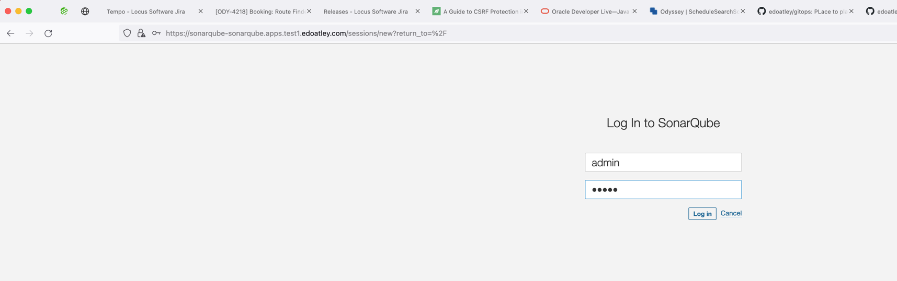
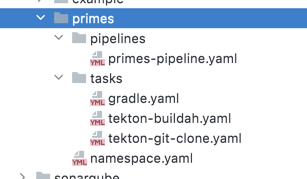
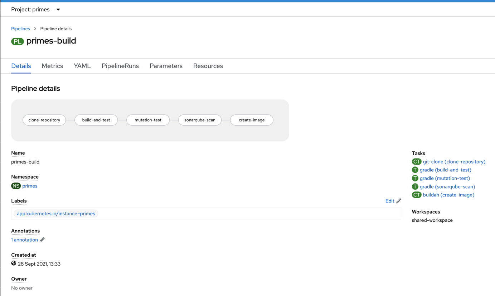
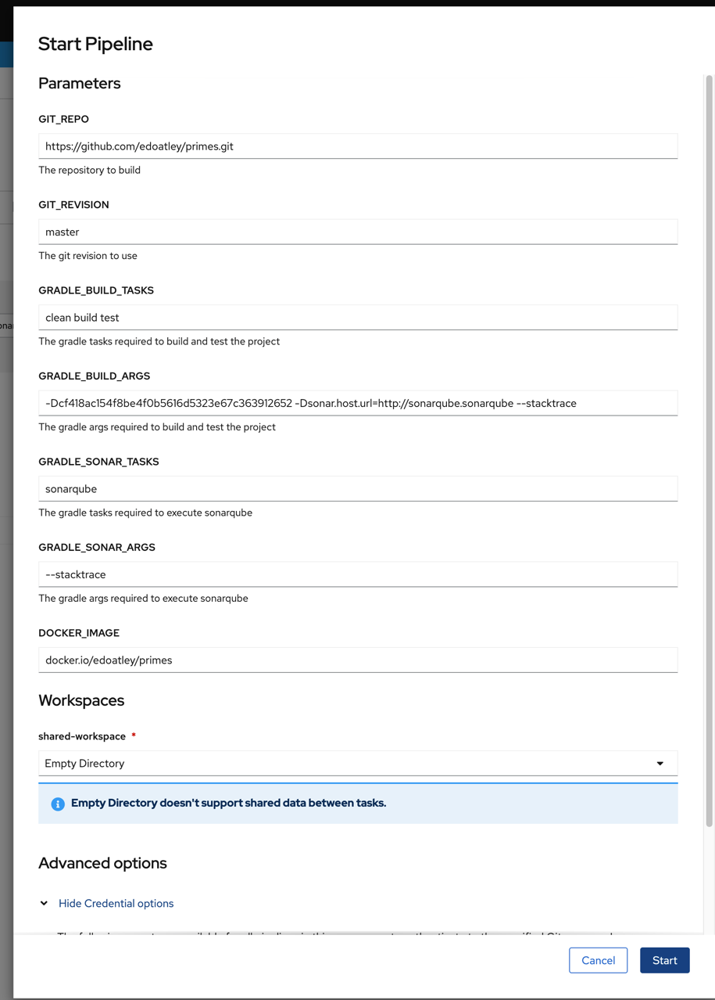

Openshift Container Platform Demo
========

## Disclaimer

- I have dabbled in OCP a bit but am still learning :) !
- OCP is running on my underfunded 

## Sample project

[The primes](https://github.com/edoatley/primes) project is a simple Kotlin microservice that takes an upper an lower bound and returns all of the 
prime numbers in between, for example:

```shell
➜  primes git:(master) curl 'http://localhost:8080/primes?start=10&end=20' -w '\n'
[11,13,17,19]
```

## CICD for the primes project on OCP 

I am going to demonstrate creating a pipeline using Tekton and GitOps and then run that pipeline to:

- checkout from github
- build and test
- mutation test
- Sonarqube test
- build and push a docker image

### 1. Set up SonarQube

```shell
# create a project
oc new-project sonarqube
# apply a sonarqube openshift template  
oc apply -f sonarqube/sonar-template.yaml
# use the template to create the objects in kubernetes 
oc process -n sonarqube sonarqube | oc create -f -
#find the route used
oc get routes -n sonarqube 
```

The default credentials were then admin/admin


### 2. Openshift GitOps (ArgoCD) to create the pipeline

There are a few key configurations we need to make this work:



Two of these tasks are provided by Openshift/tekton - namely the git clone and buildah image builder
Interestingly there seems to be little out there for gradle so created a task for that

### 3. Run ArgoCD

### 4. Run the pipeline

The pipeline looks as follows and can now be executed:



Whilst it is possible to trigger the pipeline based on a commit event or programmatically I chose to set it running using the UI:

