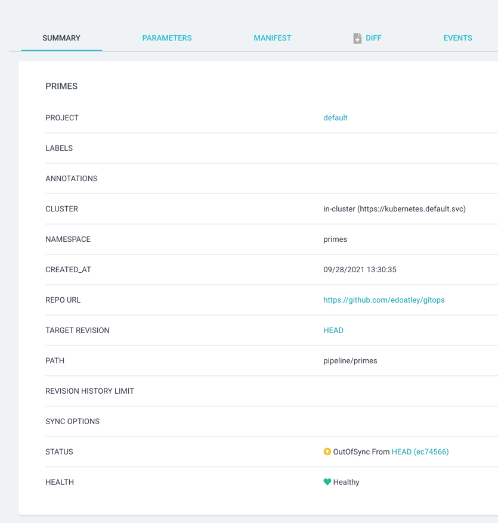
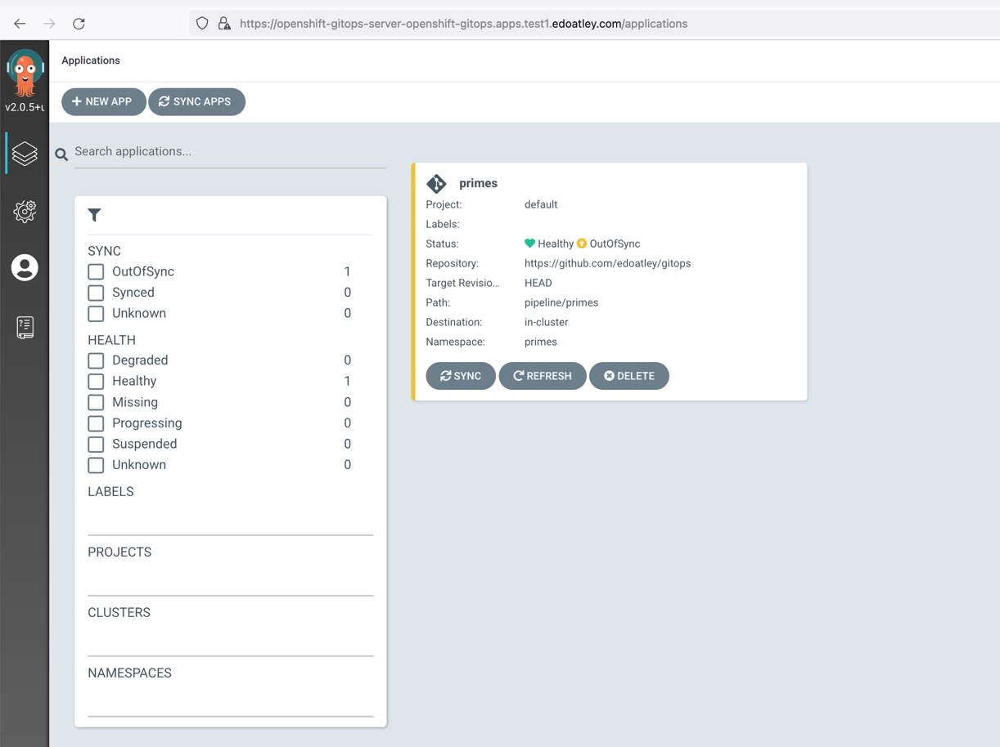
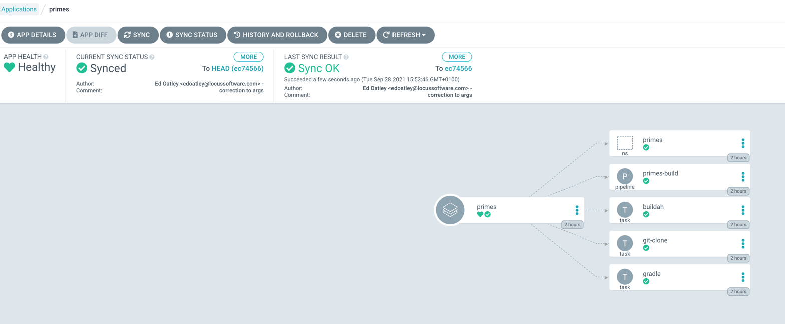
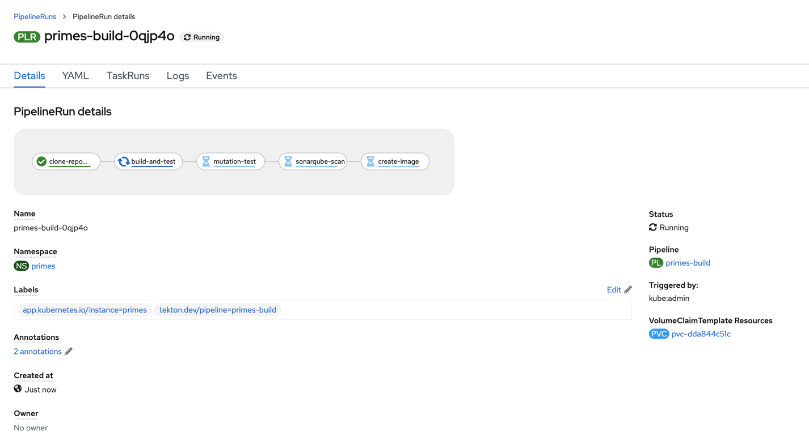
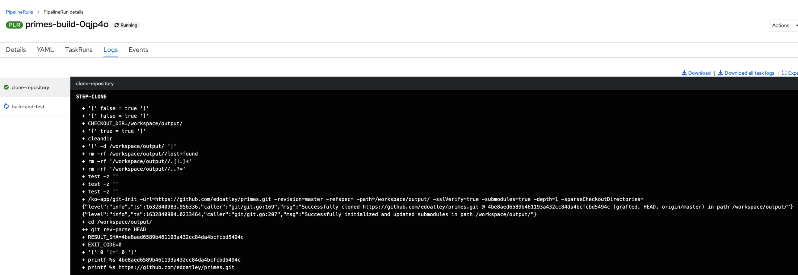

Openshift Container Platform Demo
========

## Disclaimer

- I have dabbled in OCP a bit but am still learning :) !
- OCP is running on my underfunded google cloud so is a bit slow!

## Sample project

[The primes](https://github.com/edoatley/primes) project is a simple Kotlin microservice that takes an upper an lower bound and returns all of the 
prime numbers in between, for example:

```shell
➜  primes git:(master) curl 'http://localhost:8080/primes?start=10&end=20' -w '\n'
[11,13,17,19]
```

## CICD for the primes project on OCP 

I am going to demonstrate creating a pipeline using Tekton and GitOps and then run that pipeline to:

- checkout from github
- build and test
- mutation test
- sonarqube scan
- build and push a docker image

GitOps is the practice of defining the application infrastructure in source control and then declaratively 
applying it to your runtime environment. In this way we can make a change to the infrastructure and then apply
it. ArgoCD is an example of a tool that enables gitops by scanning source control and applying changes to 
Kubernetes and it is whatpowers Openshift GitOps

Tekton is a serverless kubernetes based framework for Continuous Integration. Some key beenfits of tekton are:

1. Allows the definition of configurable tasks that can be shared allowing a standard approach
2. Very scalable and serverless allowing us to only using resources where there is demand
3. Baked into the OCP platform
4. Large community producing out of the box capabilities on [Tekton Hub](https://hub.tekton.dev/)

### 1. Set up SonarQube

```shell
# create a project
oc new-project sonarqube
# apply a sonarqube openshift template  
oc apply -f sonarqube/sonar-template.yaml
# use the template to create the objects in kubernetes 
oc process -n sonarqube sonarqube | oc create -f -
#find the route used
oc get routes -n sonarqube 
```

The default credentials were then admin/admin


### 2. Openshift GitOps (ArgoCD) to create the pipeline

There are a few key configurations we need to make this work:


Points to note:
- Two of these tasks are provided by Openshift/tekton - namely the git clone and buildah image builder
- Interestingly there seems to be little out there for gradle so I created a task for that.
- Finally there 


### 3. Run ArgoCD

Now we want to apply these configurations to the cluster and for that we use Openshift GitOps based on ArgoCD.
In ArgoCD we define an 'app' that will be made up of a number of kubernetes resources defined in source control.
ArgoCD will make OCP resemble what is defined in source control. To make this happen you define an app like this:



The key points to note are that there is a github source repo with a path and a target OCP namespace. The next
step is to tell ArgoCD to sync and make OCP match github. As you can see in this picture they do not initially:



but after clicking sync they do:



### 4. Run the pipeline

The pipeline looks as follows and can now be executed:


Whilst it is possible to trigger the pipeline based on a commit event or programmatically I chose to set it running using the UI:


Openshift then gives you a nice overview:



And the opportunity to dig into things in more detail:

