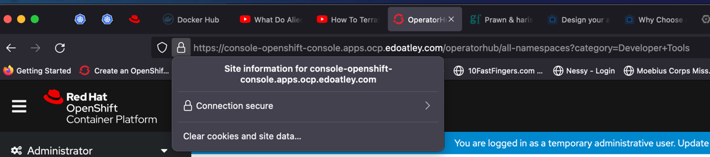

Set up TLS on the openshift cluster
===================================

## A Pre Set up

### 1 Clone acme.sh

Clone this repository https://github.com/acmesh-official/acme.sh/

### 2 Set up gcloud sdk

Follow the instructions as per the google [documentation](https://cloud.google.com/sdk/docs/install)

### 3 set up gcloud admin account

In google cloud IAM page add a new account with `DNS Administrator` privilege and download
the key file as json

## B Generate Certificates

### 1 Set up variables required by acme.sh 

```shell
# ID of the project (not display name
GCE_PROJECT=ferrous-cipher-325014    
# name of account in A3 above                                                                                                                           
GCE_SERVICE_ACCOUNT=dns-sa  
# key file downloaded in A3 above                                                                                                                                     
GCE_SERVICE_ACCOUNT_FILE=ferrous-cipher-325014-5c0e8ec99822.json      
# run the following 2 lines as they are 
LE_API=$(oc whoami --show-server | cut -f 2 -d ':' | cut -f 3 -d '/' | sed 's/-api././')                                                                 
LE_WILDCARD=$(oc get ingresscontroller default -n openshift-ingress-operator -o jsonpath='{.status.domain}')
```

### 2 execute acme.sh

```shell
~/code/openshift/letsencrypt/acme.sh master ?2 ❯ ./acme.sh --issue -d "${LE_API}" -d "*.${LE_WILDCARD}" --dns dns_gcloud                                                           Py base 18:19:31
[Sat  9 Oct 2021 18:21:50 BST] Using CA: https://acme.zerossl.com/v2/DV90
[Sat  9 Oct 2021 18:21:50 BST] Multi domain='DNS:api.ocp.edoatley.com,DNS:*.apps.ocp.edoatley.com'
[Sat  9 Oct 2021 18:21:50 BST] Getting domain auth token for each domain
[Sat  9 Oct 2021 18:21:53 BST] Getting webroot for domain='api.ocp.edoatley.com'
[Sat  9 Oct 2021 18:21:53 BST] Getting webroot for domain='*.apps.ocp.edoatley.com'
[Sat  9 Oct 2021 18:21:54 BST] Adding txt value: JuPlr_QoWONgc8vDYpHtKRYWjybhuOh7JBtLGyqPG7A for domain:  _acme-challenge.api.ocp.edoatley.com
[Sat  9 Oct 2021 18:21:54 BST] Using gcloud
Transaction started [/var/folders/cn/93th2kzj4xn4mv819kxfm__w0000gn/T/tmp.BCth1GWT/tr.yaml].
Record addition appended to transaction at [/var/folders/cn/93th2kzj4xn4mv819kxfm__w0000gn/T/tmp.BCth1GWT/tr.yaml].
Executed transaction [/var/folders/cn/93th2kzj4xn4mv819kxfm__w0000gn/T/tmp.BCth1GWT/tr.yaml] for managed-zone [edoatley-com].
Created [https://dns.googleapis.com/dns/v1/projects/ferrous-cipher-325014/managedZones/edoatley-com/changes/50].
ID  START_TIME                STATUS
50  2021-10-09T17:22:02.713Z  pending
Listed 0 items.
[Sat  9 Oct 2021 18:22:04 BST] _acme-challenge.api.ocp.edoatley.com record added
[Sat  9 Oct 2021 18:22:04 BST] The txt record is added: Success.
[Sat  9 Oct 2021 18:22:04 BST] Adding txt value: M_Q9QbsQStCrlkaEyvf3A8oGBFCSFE5JPoIyR3s54ns for domain:  _acme-challenge.apps.ocp.edoatley.com
[Sat  9 Oct 2021 18:22:04 BST] Using gcloud
Transaction started [/var/folders/cn/93th2kzj4xn4mv819kxfm__w0000gn/T/tmp.25XL59Ha/tr.yaml].
Record addition appended to transaction at [/var/folders/cn/93th2kzj4xn4mv819kxfm__w0000gn/T/tmp.25XL59Ha/tr.yaml].
Executed transaction [/var/folders/cn/93th2kzj4xn4mv819kxfm__w0000gn/T/tmp.25XL59Ha/tr.yaml] for managed-zone [edoatley-com].
Created [https://dns.googleapis.com/dns/v1/projects/ferrous-cipher-325014/managedZones/edoatley-com/changes/51].
ID  START_TIME                STATUS
51  2021-10-09T17:22:10.381Z  pending
Listed 0 items.
[Sat  9 Oct 2021 18:22:12 BST] _acme-challenge.apps.ocp.edoatley.com record added
[Sat  9 Oct 2021 18:22:12 BST] The txt record is added: Success.
[Sat  9 Oct 2021 18:22:12 BST] Let's check each DNS record now. Sleep 20 seconds first.
[Sat  9 Oct 2021 18:22:33 BST] You can use '--dnssleep' to disable public dns checks.
[Sat  9 Oct 2021 18:22:33 BST] See: https://github.com/acmesh-official/acme.sh/wiki/dnscheck
[Sat  9 Oct 2021 18:22:33 BST] Checking api.ocp.edoatley.com for _acme-challenge.api.ocp.edoatley.com
[Sat  9 Oct 2021 18:22:33 BST] Domain api.ocp.edoatley.com '_acme-challenge.api.ocp.edoatley.com' success.
[Sat  9 Oct 2021 18:22:34 BST] Checking apps.ocp.edoatley.com for _acme-challenge.apps.ocp.edoatley.com
[Sat  9 Oct 2021 18:22:34 BST] Domain apps.ocp.edoatley.com '_acme-challenge.apps.ocp.edoatley.com' success.
[Sat  9 Oct 2021 18:22:34 BST] All success, let's return
[Sat  9 Oct 2021 18:22:34 BST] Verifying: api.ocp.edoatley.com
[Sat  9 Oct 2021 18:22:35 BST] Processing, The CA is processing your order, please just wait. (1/30)
[Sat  9 Oct 2021 18:22:37 BST] Success
[Sat  9 Oct 2021 18:22:37 BST] Verifying: *.apps.ocp.edoatley.com
[Sat  9 Oct 2021 18:22:38 BST] Processing, The CA is processing your order, please just wait. (1/30)
[Sat  9 Oct 2021 18:22:41 BST] Success
[Sat  9 Oct 2021 18:22:41 BST] Removing DNS records.
[Sat  9 Oct 2021 18:22:41 BST] Removing txt: JuPlr_QoWONgc8vDYpHtKRYWjybhuOh7JBtLGyqPG7A for domain: _acme-challenge.api.ocp.edoatley.com
[Sat  9 Oct 2021 18:22:41 BST] Using gcloud
Transaction started [/var/folders/cn/93th2kzj4xn4mv819kxfm__w0000gn/T/tmp.kVCZP80B/tr.yaml].
Record removal appended to transaction at [/var/folders/cn/93th2kzj4xn4mv819kxfm__w0000gn/T/tmp.kVCZP80B/tr.yaml].
Executed transaction [/var/folders/cn/93th2kzj4xn4mv819kxfm__w0000gn/T/tmp.kVCZP80B/tr.yaml] for managed-zone [edoatley-com].
Created [https://dns.googleapis.com/dns/v1/projects/ferrous-cipher-325014/managedZones/edoatley-com/changes/52].
ID  START_TIME                STATUS
52  2021-10-09T17:22:48.567Z  pending
Listed 0 items.
[Sat  9 Oct 2021 18:22:50 BST] _acme-challenge.api.ocp.edoatley.com record added
[Sat  9 Oct 2021 18:22:50 BST] Removed: Success
[Sat  9 Oct 2021 18:22:50 BST] Removing txt: M_Q9QbsQStCrlkaEyvf3A8oGBFCSFE5JPoIyR3s54ns for domain: _acme-challenge.apps.ocp.edoatley.com
[Sat  9 Oct 2021 18:22:50 BST] Using gcloud
Transaction started [/var/folders/cn/93th2kzj4xn4mv819kxfm__w0000gn/T/tmp.Gnq8u9Cq/tr.yaml].
Record removal appended to transaction at [/var/folders/cn/93th2kzj4xn4mv819kxfm__w0000gn/T/tmp.Gnq8u9Cq/tr.yaml].
Executed transaction [/var/folders/cn/93th2kzj4xn4mv819kxfm__w0000gn/T/tmp.Gnq8u9Cq/tr.yaml] for managed-zone [edoatley-com].
Created [https://dns.googleapis.com/dns/v1/projects/ferrous-cipher-325014/managedZones/edoatley-com/changes/53].
ID  START_TIME                STATUS
53  2021-10-09T17:22:57.042Z  pending
Listed 0 items.
[Sat  9 Oct 2021 18:22:59 BST] _acme-challenge.apps.ocp.edoatley.com record added
[Sat  9 Oct 2021 18:22:59 BST] Removed: Success
[Sat  9 Oct 2021 18:22:59 BST] Verify finished, start to sign.
[Sat  9 Oct 2021 18:22:59 BST] Lets finalize the order.
[Sat  9 Oct 2021 18:22:59 BST] Le_OrderFinalize='https://acme.zerossl.com/v2/DV90/order/FZDgrvs5S3R9E83qs8UQ8g/finalize'
[Sat  9 Oct 2021 18:23:00 BST] Order status is processing, lets sleep and retry.
[Sat  9 Oct 2021 18:23:00 BST] Retry after: 15
[Sat  9 Oct 2021 18:23:16 BST] Polling order status: https://acme.zerossl.com/v2/DV90/order/FZDgrvs5S3R9E83qs8UQ8g
[Sat  9 Oct 2021 18:23:16 BST] Downloading cert.
[Sat  9 Oct 2021 18:23:16 BST] Le_LinkCert='https://acme.zerossl.com/v2/DV90/cert/aWraZRqZFe9SvKKjNB6i4Q'
[Sat  9 Oct 2021 18:23:17 BST] Cert success.
-----BEGIN CERTIFICATE-----
MIIGkTCCBHmgAwIBAgIRALOWbw+pLrica61MDrgY6J4wDQYJKoZIhvcNAQEMBQAw
SzELMAkGA1UEBhMCQVQxEDAOBgNVBAoTB1plcm9TU0wxKjAoBgNVBAMTIVplcm9T
U0wgUlNBIERvbWFpbiBTZWN1cmUgU2l0ZSBDQTAeFw0yMTEwMDkwMDAwMDBaFw0y
MjAxMDcyMzU5NTlaMB8xHTAbBgNVBAMTFGFwaS5vY3AuZWRvYXRsZXkuY29tMIIB
IjANBgkqhkiG9w0BAQEFAAOCAQ8AMIIBCgKCAQEAp8KQVOTtb0uGWQM1IgZAaedL
2rtl4A6eX+z6NADDvjfeoedqoCe0J3uEqrOmvjUm9DtJ7mj5n7XnVC9g3+0yM82w
Dw1KyIASdeaVcWuVkkoY+KbyUZj97hnlAO+XkFZaVqbjDcsOTwXyvz8QOmMtOsKw
mtUyaSe1ErgxNjGkV32wM31s7efG+UI19NGdPaixWJD7AoWSnZ4bdIX6FZUOZpS2
iTSxFpNEc//T61622GJtD+ZCHFVYZ34KzygMskiDO4y7o7gGtJ2VkY2Yr2QCPs6M
Tn4Q9GH21v9eig2WpwWcW+x2mMoWijtYl33cSbGyM/edV0DfCNwF0WU7NNHRuwID
AQABo4ICmjCCApYwHwYDVR0jBBgwFoAUyNl4aKLZGWjVPXLeXwo+3LWGhqYwHQYD
VR0OBBYEFGIKH9BhAPuJs+RAMzhSeZZzTo9DMA4GA1UdDwEB/wQEAwIFoDAMBgNV
HRMBAf8EAjAAMB0GA1UdJQQWMBQGCCsGAQUFBwMBBggrBgEFBQcDAjBJBgNVHSAE
QjBAMDQGCysGAQQBsjEBAgJOMCUwIwYIKwYBBQUHAgEWF2h0dHBzOi8vc2VjdGln
by5jb20vQ1BTMAgGBmeBDAECATCBiAYIKwYBBQUHAQEEfDB6MEsGCCsGAQUFBzAC
hj9odHRwOi8vemVyb3NzbC5jcnQuc2VjdGlnby5jb20vWmVyb1NTTFJTQURvbWFp
blNlY3VyZVNpdGVDQS5jcnQwKwYIKwYBBQUHMAGGH2h0dHA6Ly96ZXJvc3NsLm9j
c3Auc2VjdGlnby5jb20wggEFBgorBgEEAdZ5AgQCBIH2BIHzAPEAdwBGpVXrdfqR
IDC1oolp9PN9ESxBdL79SbiFq/L8cP5tRwAAAXxmFFRAAAAEAwBIMEYCIQCToUCw
vypgo80ttGWxG4dLHNfxveD8+1/6K8MTP8L6PAIhAIy1eAozqts5JWPPTj+X5QTd
GrgQNnvr4jFmY5tsgqVvAHYAQcjKsd8iRkoQxqE6CUKHXk4xixsD6+tLx2jwkGKW
BvYAAAF8ZhRUSQAABAMARzBFAiBi9CXmOIvfTWDRTwmsUGJqX3rxk4jNAJwfrlT1
5MyZIQIhAJ8ZumZt+SA0/SdWIay0jRj/wmFEHHR3XCN2OYPP3V7eMDgGA1UdEQQx
MC+CFGFwaS5vY3AuZWRvYXRsZXkuY29tghcqLmFwcHMub2NwLmVkb2F0bGV5LmNv
bTANBgkqhkiG9w0BAQwFAAOCAgEAKJAzvAR+5UzJUFPA7mvSleiJuoOG2v6hGBb5
gXI1IE0g9obkcNm2Wj+BITSLPWuH8sdHuJtW+VA4Ucm93DQ4twMfdZAO9yehoStk
yHFR985gl/nnf0IxqGSKU3NGPxvL6coFYY+u2tK4L6+bhN2sI3awn+Ab2pU/N2Sb
7aBTjOnPoAWyroCiRZouRDR+JlMedHlfF8Nmxto1aTdfo5jLRXrUrfXH1dYY8QRp
jbL0lb5hjGVIOS43opJJ1lmqrklOsXBunoSrNZ7Uii2UhFQFywhwUetO6dVIfLUe
9WXLiU3TTOx0jOy0f1yzbah6XU4GgzOhkCEE2qAC3d3ECsAR6W6T2+Sv3MVOxKy6
G4SfXWhKrNH6OXqKRsS6/ck+n2nH476BTY0KuVkhKGANII3XkX8iZTmz0/D5j04S
3SJED6jnUJxvfbM7Prb/U2Y4LEWh/s/SyUjrrlCbCwdrdG4FmQI952G3FsV91FwY
RfeL+pTQQ1N5tozsVtG1VVyjKi4Xn/I8wKcKWcy9pWanhs3eS8O7OykoJHEe4vrC
RSd7vR/OoxJx0ew65mmEvcPm/qEBh7AX3fZ5zdCRqxBperXeKMGbJZy0rnoePRPX
xsoqGR6p0DBQCZHc1RxI1OM6gAQQz+DPJ1jdrhOYCNSba/QDUYMVouE8elmcIb4G
bPNdwYU=
-----END CERTIFICATE-----
[Sat  9 Oct 2021 18:23:17 BST] Your cert is in: /Users/edoatley/.acme.sh/api.ocp.edoatley.com/api.ocp.edoatley.com.cer
[Sat  9 Oct 2021 18:23:17 BST] Your cert key is in: /Users/edoatley/.acme.sh/api.ocp.edoatley.com/api.ocp.edoatley.com.key
[Sat  9 Oct 2021 18:23:17 BST] The intermediate CA cert is in: /Users/edoatley/.acme.sh/api.ocp.edoatley.com/ca.cer
[Sat  9 Oct 2021 18:23:17 BST] And the full chain certs is there: /Users/edoatley/.acme.sh/api.ocp.edoatley.com/fullchain.cer
```

### 3 Save a copy of the certificates...

I was not sure this is necessary but is is described [here](https://cloud.redhat.com/blog/requesting-and-installing-lets-encrypt-certificates-for-openshift-4)

```shell
~/code/openshift/letsencrypt/acme.sh master ?2 ❯ mkdir ~/code/openshift/letsencrypt/certificates                                                                            1m 29s Py base 18:23:18
~/code/openshift/letsencrypt/acme.sh master ?2 ❯ CERTDIR=~/code/openshift/letsencrypt/certificates                                                                                 Py base 18:43:57
~/code/openshift/letsencrypt/acme.sh master ?2 ❯ ./acme.sh --install-cert -d ${LE_API} -d *.${LE_WILDCARD} --cert-file ${CERTDIR}/cert.pem --key-file ${CERTDIR}/key.pem --fullchain-file ${CERTDIR}/fullchain.pem --ca-file ${CERTDIR}/ca.cer                                                                       
zsh: no matches found: *.apps.ocp.edoatley.com
~/code/openshift/letsencrypt/acme.sh master ?2 ❯ ./acme.sh --install-cert -d ${LE_API} -d "*.${LE_WILDCARD}" --cert-file ${CERTDIR}/cert.pem --key-file ${CERTDIR}/key.pem --fullchain-file ${CERTDIR}/fullchain.pem --ca-file ${CERTDIR}/ca.cer
[Sat  9 Oct 2021 18:45:56 BST] Installing cert to: /Users/edoatley/code/openshift/letsencrypt/certificates/cert.pem
[Sat  9 Oct 2021 18:45:56 BST] Installing CA to: /Users/edoatley/code/openshift/letsencrypt/certificates/ca.cer
[Sat  9 Oct 2021 18:45:56 BST] Installing key to: /Users/edoatley/code/openshift/letsencrypt/certificates/key.pem
[Sat  9 Oct 2021 18:45:56 BST] Installing full chain to: /Users/edoatley/code/openshift/letsencrypt/certificates/fullchain.pem
```

## C Install on openshift

Note this relies on `CERTDIR` being set

### 1 create a secret

```shell
oc create secret tls router-certs --cert=${CERTDIR}/fullchain.pem --key=${CERTDIR}/key.pem -n openshift-ingress
```
### 2 make ingress controller use it!

```shell
oc patch ingresscontroller default -n openshift-ingress-operator --type=merge --patch='{"spec": { "defaultCertificate": { "name": "router-certs" }}}'
```

### 3 Check the UI to see if it worked



### 4 Update the API server

```shell
oc create secret tls api-certs --cert=${CERTDIR}/fullchain.pem --key=${CERTDIR}/key.pem -n openshift-config
oc patch apiserver cluster --type merge --patch="{\"spec\": {\"servingCerts\": {\"namedCertificates\": [ { \"names\": [  \"$LE_API\"  ], \"servingCertificate\": {\"name\": \"api-certs\" }}]}}}"
```

You may get an error like this

```shell
~/co/primes master !1 ❯ oc new-project primes                                                         
Unable to connect to the server: x509: certificate signed by unknown authority
```

The documentation I was following said 

> You now have proper certificates on the API Endpoint. Note that depending on the age of your operating system you may 
still see an insecure connection error when using the `oc login` command - newer operating systems already trust the 
Let’s Encrypt certificate authority.

Possibly an issue with the certificate chain as per https://github.com/openshift/origin/issues/11151 - but would need looking at 

## D Secure a service

https://access.redhat.com/documentation/en-us/openshift_container_platform/4.1/html/authentication/configuring-certificates

### 1 Create a deployment

```shell
oc create deployment primes --image edoatley/primes 
```

### 2 Expose as a service

```shell
oc expose deployment primes
```

### 3 Expose as a route

```shell
oc expose service primes
```

## E Call the TLS secured service

```shell
~/code/primes master ❯ curl --verbose "http://primes-primes.apps.ocp.edoatley.com/primes?start=90&end=111"                                                                         Py base 20:51:02
*   Trying 34.89.60.103:80...
* Connected to primes-primes.apps.ocp.edoatley.com (34.89.60.103) port 80 (#0)
> GET /primes?start=90&end=111 HTTP/1.1
> Host: primes-primes.apps.ocp.edoatley.com
> User-Agent: curl/7.71.1
> Accept: */*
> 
* Mark bundle as not supporting multiuse
< HTTP/1.1 200 OK
< Cache-Control: private
< Content-Length: 20
< Content-Type: application/json
< Set-Cookie: c2309205db1bf40ac3febcfe71e802a8=c4125ce5680a005a62c8ce1181a1e5b3; path=/; HttpOnly
< Date: Sat, 09 Oct 2021 19:56:00 GMT
< 
* Connection #0 to host primes-primes.apps.ocp.edoatley.com left intact
[97,101,103,107,109]%   
```

https did not work though so I added a route resource via the UI:

```yaml
kind: Route
apiVersion: route.openshift.io/v1
metadata:
  name: primes
  namespace: primes
  labels:
    app: primes
  annotations:
    openshift.io/host.generated: 'true'
spec:
  host: primes-primes.apps.ocp.edoatley.com
  to:
    kind: Service
    name: primes
    weight: 100
  port:
    targetPort: 8080
  tls:
    termination: edge
    insecureEdgeTerminationPolicy: Redirect
  wildcardPolicy: None
```

and tada:

```shell
~/code/primes master ❯ curl --verbose "https://primes-primes.apps.ocp.edoatley.com/primes?start=90&end=111"                                                                        Py base 20:52:33
*   Trying 34.89.60.103:443...
* Connected to primes-primes.apps.ocp.edoatley.com (34.89.60.103) port 443 (#0)
* ALPN, offering http/1.1
* successfully set certificate verify locations:
*   CAfile: /Users/edoatley/opt/anaconda3/ssl/cacert.pem
  CApath: none
* TLSv1.3 (OUT), TLS handshake, Client hello (1):
* TLSv1.3 (IN), TLS handshake, Server hello (2):
* TLSv1.3 (IN), TLS handshake, Encrypted Extensions (8):
* TLSv1.3 (IN), TLS handshake, Certificate (11):
* TLSv1.3 (IN), TLS handshake, CERT verify (15):
* TLSv1.3 (IN), TLS handshake, Finished (20):
* TLSv1.3 (OUT), TLS change cipher, Change cipher spec (1):
* TLSv1.3 (OUT), TLS handshake, Finished (20):
* SSL connection using TLSv1.3 / TLS_AES_256_GCM_SHA384
* ALPN, server did not agree to a protocol
* Server certificate:
*  subject: CN=api.ocp.edoatley.com
*  start date: Oct  9 00:00:00 2021 GMT
*  expire date: Jan  7 23:59:59 2022 GMT
*  subjectAltName: host "primes-primes.apps.ocp.edoatley.com" matched cert's "*.apps.ocp.edoatley.com"
*  issuer: C=AT; O=ZeroSSL; CN=ZeroSSL RSA Domain Secure Site CA
*  SSL certificate verify ok.
> GET /primes?start=90&end=111 HTTP/1.1
> Host: primes-primes.apps.ocp.edoatley.com
> User-Agent: curl/7.71.1
> Accept: */*
> 
* TLSv1.3 (IN), TLS handshake, Newsession Ticket (4):
* TLSv1.3 (IN), TLS handshake, Newsession Ticket (4):
* old SSL session ID is stale, removing
* Mark bundle as not supporting multiuse
< HTTP/1.1 200 OK
< content-type: application/json
< content-length: 20
< set-cookie: c2309205db1bf40ac3febcfe71e802a8=c0a8352cb6515a41565dbbb3e8dbc77a; path=/; HttpOnly; Secure; SameSite=None
< cache-control: private
< 
* Connection #0 to host primes-primes.apps.ocp.edoatley.com left intact
[97,101,103,107,109]                                                                                                                                                                               
```