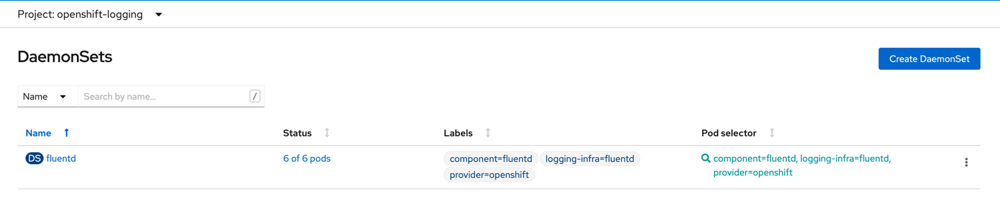

Openshift  Logging
==================

## Install OCP
```shell
~/code/openshift ❯ ./openshift-install create cluster
? SSH Public Key /Users/edoatley/.ssh/id_rsa.pub
? Platform gcp
INFO Credentials loaded from file "/Users/edoatley/.gcp/osServiceAccount.json" 
? Project ID RedHatOpenShift (ferrous-cipher-325014)
? Region europe-west2
? Base Domain edoatley.com
? Cluster Name ocp
? Pull Secret [? for help] *********************************************************************************************************************************************************************************************************************************************************************************************************************************************************************************WARNING Following quotas compute.googleapis.com/cpus (europe-west2) are available but will be completely used pretty soon. ***************************************************************************INFO Creating infrastructure resources...         ****************************************************************************************************************************************************INFO Waiting up to 20m0s for the Kubernetes API at https://api.ocp.edoatley.com:6443... **************************************************************************************************************INFO API v1.21.1+9807387 up                       ****************************************************************************************************************************************************INFO Waiting up to 30m0s for bootstrapping to complete... ********************************************************************************************************************************************INFO Destroying the bootstrap resources...        ****************************************************************************************************************************************************INFO Waiting up to 40m0s for the cluster at https://api.ocp.edoatley.com:6443 to initialize... *************************************************************************************************************************************************************************************************************************************************************************************************************INFO Waiting up to 10m0s for the openshift-console route to be created... ****************************************************************************************************************************INFO Install complete!                            ****************************************************************************************************************************************************
INFO To access the cluster as the system:admin user when using 'oc', run 'export KUBECONFIG=/Users/edoatley/code/openshift/auth/kubeconfig'
INFO Access the OpenShift web-console here: https://console-openshift-console.apps.ocp.edoatley.com 
INFO Login to the console with user: "kubeadmin", and password: "cbeMq-kwMnc-ocEXB-mWXCk" 
INFO Time elapsed: 30m13s                         
```
## Step by step install

1. Add the [namespaces](./resources/namespaces)
```shell
$ oc apply -f ./resources/namespaces 
namespace/openshift-logging created
namespace/openshift-operators-redhat created
```

2. Add an [elastic search operator group](./resources/operators/es-operator-group.yaml)
```shell
$ oc apply -f ./resources/operators/es-operator-group.yaml                
operatorgroup.operators.coreos.com/openshift-operators-redhat created
```

3. Install the [elastic search operator](./resources/operators/elasticsearch-operator.yaml) 
```shell
$ oc apply -f ./resources/operators/elasticsearch-operator.yaml                                    
subscription.operators.coreos.com/elasticsearch-operator created
````

4. Validate install of operator:
```shell
~/code/openshift/gitops/logging main +5 !5 ?2 ❯ oc get csv --all-namespaces                                                                                                Py base ○ admin 17:07:52
NAMESPACE                                          NAME                             DISPLAY                            VERSION   REPLACES   PHASE
default                                            elasticsearch-operator.5.0.8-6   OpenShift Elasticsearch Operator   5.0.8-6              Succeeded
kube-node-lease                                    elasticsearch-operator.5.0.8-6   OpenShift Elasticsearch Operator   5.0.8-6              Succeeded
kube-public                                        elasticsearch-operator.5.0.8-6   OpenShift Elasticsearch Operator   5.0.8-6              Succeeded
kube-system                                        elasticsearch-operator.5.0.8-6   OpenShift Elasticsearch Operator   5.0.8-6              Succeeded
openshift-apiserver-operator                       elasticsearch-operator.5.0.8-6   OpenShift Elasticsearch Operator   5.0.8-6              Succeeded
openshift-apiserver                                elasticsearch-operator.5.0.8-6   OpenShift Elasticsearch Operator   5.0.8-6              Succeeded
openshift-authentication-operator                  elasticsearch-operator.5.0.8-6   OpenShift Elasticsearch Operator   5.0.8-6              Succeeded
openshift-authentication                           elasticsearch-operator.5.0.8-6   OpenShift Elasticsearch Operator   5.0.8-6              Succeeded
openshift-cloud-credential-operator                elasticsearch-operator.5.0.8-6   OpenShift Elasticsearch Operator   5.0.8-6              Succeeded
openshift-cluster-csi-drivers                      elasticsearch-operator.5.0.8-6   OpenShift Elasticsearch Operator   5.0.8-6              Succeeded
openshift-cluster-machine-approver                 elasticsearch-operator.5.0.8-6   OpenShift Elasticsearch Operator   5.0.8-6              Succeeded
openshift-cluster-node-tuning-operator             elasticsearch-operator.5.0.8-6   OpenShift Elasticsearch Operator   5.0.8-6              Succeeded
openshift-cluster-samples-operator                 elasticsearch-operator.5.0.8-6   OpenShift Elasticsearch Operator   5.0.8-6              Succeeded
openshift-cluster-storage-operator                 elasticsearch-operator.5.0.8-6   OpenShift Elasticsearch Operator   5.0.8-6              Succeeded
openshift-cluster-version                          elasticsearch-operator.5.0.8-6   OpenShift Elasticsearch Operator   5.0.8-6              Succeeded
openshift-config-managed                           elasticsearch-operator.5.0.8-6   OpenShift Elasticsearch Operator   5.0.8-6              Succeeded
openshift-config-operator                          elasticsearch-operator.5.0.8-6   OpenShift Elasticsearch Operator   5.0.8-6              Succeeded
openshift-config                                   elasticsearch-operator.5.0.8-6   OpenShift Elasticsearch Operator   5.0.8-6              Succeeded
openshift-console-operator                         elasticsearch-operator.5.0.8-6   OpenShift Elasticsearch Operator   5.0.8-6              Succeeded
openshift-console-user-settings                    elasticsearch-operator.5.0.8-6   OpenShift Elasticsearch Operator   5.0.8-6              Succeeded
openshift-console                                  elasticsearch-operator.5.0.8-6   OpenShift Elasticsearch Operator   5.0.8-6              Succeeded
openshift-controller-manager-operator              elasticsearch-operator.5.0.8-6   OpenShift Elasticsearch Operator   5.0.8-6              Succeeded
openshift-controller-manager                       elasticsearch-operator.5.0.8-6   OpenShift Elasticsearch Operator   5.0.8-6              Succeeded
openshift-dns-operator                             elasticsearch-operator.5.0.8-6   OpenShift Elasticsearch Operator   5.0.8-6              Succeeded
openshift-dns                                      elasticsearch-operator.5.0.8-6   OpenShift Elasticsearch Operator   5.0.8-6              Succeeded
openshift-etcd-operator                            elasticsearch-operator.5.0.8-6   OpenShift Elasticsearch Operator   5.0.8-6              Succeeded
openshift-etcd                                     elasticsearch-operator.5.0.8-6   OpenShift Elasticsearch Operator   5.0.8-6              Succeeded
openshift-host-network                             elasticsearch-operator.5.0.8-6   OpenShift Elasticsearch Operator   5.0.8-6              Succeeded
openshift-image-registry                           elasticsearch-operator.5.0.8-6   OpenShift Elasticsearch Operator   5.0.8-6              Succeeded
openshift-infra                                    elasticsearch-operator.5.0.8-6   OpenShift Elasticsearch Operator   5.0.8-6              Succeeded
openshift-ingress-canary                           elasticsearch-operator.5.0.8-6   OpenShift Elasticsearch Operator   5.0.8-6              Succeeded
openshift-ingress-operator                         elasticsearch-operator.5.0.8-6   OpenShift Elasticsearch Operator   5.0.8-6              Succeeded
openshift-ingress                                  elasticsearch-operator.5.0.8-6   OpenShift Elasticsearch Operator   5.0.8-6              Succeeded
openshift-insights                                 elasticsearch-operator.5.0.8-6   OpenShift Elasticsearch Operator   5.0.8-6              Succeeded
openshift-kni-infra                                elasticsearch-operator.5.0.8-6   OpenShift Elasticsearch Operator   5.0.8-6              Succeeded
openshift-kube-apiserver-operator                  elasticsearch-operator.5.0.8-6   OpenShift Elasticsearch Operator   5.0.8-6              Succeeded
openshift-kube-apiserver                           elasticsearch-operator.5.0.8-6   OpenShift Elasticsearch Operator   5.0.8-6              Succeeded
openshift-kube-controller-manager-operator         elasticsearch-operator.5.0.8-6   OpenShift Elasticsearch Operator   5.0.8-6              Succeeded
openshift-kube-controller-manager                  elasticsearch-operator.5.0.8-6   OpenShift Elasticsearch Operator   5.0.8-6              Succeeded
openshift-kube-scheduler-operator                  elasticsearch-operator.5.0.8-6   OpenShift Elasticsearch Operator   5.0.8-6              Succeeded
openshift-kube-scheduler                           elasticsearch-operator.5.0.8-6   OpenShift Elasticsearch Operator   5.0.8-6              Succeeded
openshift-kube-storage-version-migrator-operator   elasticsearch-operator.5.0.8-6   OpenShift Elasticsearch Operator   5.0.8-6              Succeeded
openshift-kube-storage-version-migrator            elasticsearch-operator.5.0.8-6   OpenShift Elasticsearch Operator   5.0.8-6              Succeeded
openshift-kubevirt-infra                           elasticsearch-operator.5.0.8-6   OpenShift Elasticsearch Operator   5.0.8-6              Succeeded
openshift-logging                                  elasticsearch-operator.5.0.8-6   OpenShift Elasticsearch Operator   5.0.8-6              Succeeded
openshift-machine-api                              elasticsearch-operator.5.0.8-6   OpenShift Elasticsearch Operator   5.0.8-6              Succeeded
openshift-machine-config-operator                  elasticsearch-operator.5.0.8-6   OpenShift Elasticsearch Operator   5.0.8-6              Succeeded
openshift-marketplace                              elasticsearch-operator.5.0.8-6   OpenShift Elasticsearch Operator   5.0.8-6              Succeeded
openshift-monitoring                               elasticsearch-operator.5.0.8-6   OpenShift Elasticsearch Operator   5.0.8-6              Succeeded
openshift-multus                                   elasticsearch-operator.5.0.8-6   OpenShift Elasticsearch Operator   5.0.8-6              Succeeded
openshift-network-diagnostics                      elasticsearch-operator.5.0.8-6   OpenShift Elasticsearch Operator   5.0.8-6              Succeeded
openshift-network-operator                         elasticsearch-operator.5.0.8-6   OpenShift Elasticsearch Operator   5.0.8-6              Succeeded
openshift-node                                     elasticsearch-operator.5.0.8-6   OpenShift Elasticsearch Operator   5.0.8-6              Succeeded
openshift-oauth-apiserver                          elasticsearch-operator.5.0.8-6   OpenShift Elasticsearch Operator   5.0.8-6              Succeeded
openshift-openstack-infra                          elasticsearch-operator.5.0.8-6   OpenShift Elasticsearch Operator   5.0.8-6              Succeeded
openshift-operator-lifecycle-manager               elasticsearch-operator.5.0.8-6   OpenShift Elasticsearch Operator   5.0.8-6              Succeeded
openshift-operator-lifecycle-manager               packageserver                    Package Server                     0.17.0               Succeeded
openshift-operators-redhat                         elasticsearch-operator.5.0.8-6   OpenShift Elasticsearch Operator   5.0.8-6              Succeeded
openshift-operators                                elasticsearch-operator.5.0.8-6   OpenShift Elasticsearch Operator   5.0.8-6              Succeeded
openshift-ovirt-infra                              elasticsearch-operator.5.0.8-6   OpenShift Elasticsearch Operator   5.0.8-6              Succeeded
openshift-sdn                                      elasticsearch-operator.5.0.8-6   OpenShift Elasticsearch Operator   5.0.8-6              Succeeded
openshift-service-ca-operator                      elasticsearch-operator.5.0.8-6   OpenShift Elasticsearch Operator   5.0.8-6              Succeeded
openshift-service-ca                               elasticsearch-operator.5.0.8-6   OpenShift Elasticsearch Operator   5.0.8-6              Succeeded
openshift-user-workload-monitoring                 elasticsearch-operator.5.0.8-6   OpenShift Elasticsearch Operator   5.0.8-6              Succeeded
openshift-vsphere-infra                            elasticsearch-operator.5.0.8-6   OpenShift Elasticsearch Operator   5.0.8-6              Succeeded
openshift                                          elasticsearch-operator.5.0.8-6   OpenShift Elasticsearch Operator   5.0.8-6              Succeeded
```

5. Add an [Openshift Logging Operator Group](./resources/operators/logging-operator-group.yaml)
```shell
$ oc apply -f ./resources/operators/logging-operator-group.yaml
operatorgroup.operators.coreos.com/cluster-logging created
````

6. Install the [Openshift Logging Operator](./resources/operators/logging-operator.yaml)
```shell
$ oc apply -f ./resources/operators/logging-operator.yaml
subscription.operators.coreos.com/cluster-logging created
```

7. Validate the install of the Openshift Logging Operator:
```shell
$ oc get csv -n openshift-logging
NAME                             DISPLAY                            VERSION   REPLACES   PHASE
cluster-logging.5.0.8-7          Red Hat OpenShift Logging          5.0.8-7              Succeeded
elasticsearch-operator.5.0.8-6   OpenShift Elasticsearch Operator   5.0.8-6              Succeeded
```

8. Create a [Custom Resource Definition for cluster logging](./resources/crd/clusterlogging.yaml)
```shell
$ oc create -f resources/crd/clusterlogging.yaml
clusterlogging.logging.openshift.io/instance created
```

9. Verify the installation by checking the pods created and initially got:
```shell
$ oc get pods -n openshift-logging                                                                                           Py base ○ admin 17:28:57
NAME                                        READY   STATUS     RESTARTS   AGE
cluster-logging-operator-744f7bdffb-s8dnj   1/1     Running    0          18m
fluentd-27drm                               0/1     Init:0/1   6          12m
fluentd-84fg2                               0/1     Init:0/1   6          12m
fluentd-kxs8m                               0/1     Init:0/1   6          12m
fluentd-lxbnn                               0/1     Init:0/1   6          12m
fluentd-vgh6r                               0/1     Init:0/1   6          12m
kibana-6bc7575f86-bxlm7                     2/2     Running    0          12m
```

Tried adding a new node and labelling infra:

```shell
oc label node ocp-dgs4s-worker-c-qx4sr node-role.kubernetes.io/infra="" 
```
not sure this made any difference....

Then went into the UI and edited the fluentd daemonset:



removing the taints that were listed this is a hack but it appeared to work


```shell
~/code/openshift/gitops/logging main +8 !6 ?2 ❯ oc get pods -n openshift-logging                                                                                         18s Py base ○ admin 17:52:32
NAME                                            READY   STATUS      RESTARTS   AGE
cluster-logging-operator-744f7bdffb-s8dnj       1/1     Running     0          39m
elasticsearch-cdm-knlu729r-1-64bf656895-hmbvv   2/2     Running     0          5m37s
elasticsearch-im-app-27238605-r9q9t             0/1     Completed   0          3m59s
elasticsearch-im-audit-27238605-vm887           0/1     Completed   0          3m59s
elasticsearch-im-infra-27238605-wszxb           0/1     Completed   0          3m59s
fluentd-6sts9                                   1/1     Running     0          114s
fluentd-kxs8m                                   1/1     Running     0          34m
fluentd-lxbnn                                   1/1     Running     0          34m
fluentd-mqgk5                                   1/1     Running     0          94s
fluentd-nzvtp                                   1/1     Running     0          104s
fluentd-vgh6r                                   1/1     Running     0          34m
kibana-6bc7575f86-bxlm7                         2/2     Running     0          33m
```